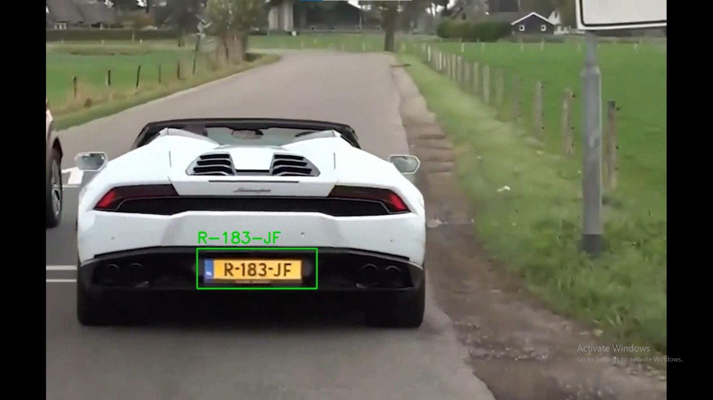

# 🚗 Video License Plate Detection and Recognition (ANPR System)

A computer vision project that detects and recognizes vehicle license plates from **traffic videos** (moving vehicles). Uses OpenCV Haar cascade for detection, EasyOCR for text recognition, and SORT tracking to associate unique plates per vehicle.

Outputs:
- An annotated output video with bounding boxes and recognized plate text.
- A CSV file listing unique vehicle track IDs and their best-recognized license plate numbers.

Built as an extension of traditional image-based ANPR for real-time road safety and traffic monitoring applications.

 <!-- Replace with your actual screenshot if available -->

## 🧠 Project Overview

This system processes videos of moving traffic to:
- Detect license plates frame-by-frame.
- Track vehicles across frames to avoid duplicate readings.
- Recognize plate text using OCR.
- Export unique results to CSV for logging/analysis.

Ideal for applications like traffic enforcement, violation detection, or vehicle logging.

## 📌 Features

- Video input support (MP4, etc.).
- Real-time frame processing with plate detection.
- Multi-object tracking (SORT) for unique vehicle IDs.
- OCR text cleaning and best-reading selection per vehicle.
- Visualized output video + CSV export.
- Runs in Google Colab (GPU recommended for faster OCR).

## 🛠 Tech Stack

- OpenCV (detection & video processing)
- EasyOCR (text recognition)
- SORT (Simple Online Realtime Tracking)
- NumPy, FilterPy, SciPy (for tracking)

## 🚀 Getting Started

### Run in Google Colab (Recommended)

1. Open this Colab notebook: [Link to your .ipynb if uploaded, or paste code cells]
2. Install dependencies:
   ```bash
   !pip install easyocr opencv-python-headless filterpy scipy lap

3. Upload your video when prompted.
4. Run all cells – downloads output_video.mp4 and plates.csv.


Local Setup
```Bash
git clone https://github.com/YOUR_USERNAME/Video-License-Plate-Detection-ANPR.git
cd Video-License-Plate-Detection-ANPR
pip install easyocr opencv-python filterpy scipy lap
python video_license_plate_detection.py --input your_video.mp4
```


## 📊 Sample Output
Example CSV (plates.csv):
- textTrack ID,Plate Number
- 1,R-183-JF
- 3,N-894-JV
- 4,L-656-XH


## 🔧 Limitations & Improvements

- Accuracy: ~70-80% on real traffic videos (Haar cascade is basic; sensitive to lighting/angles).
Future Ideas:
- Switch to YOLOv8 for 95%+ detection accuracy.
- Add speed estimation or violation detection.
- Web dashboard for results.


## 📚 References

- Inspired by: Sadvikha/License-Plate-Detection-and-Road-Safety-System
- SORT Tracking: Original implementation by Alex Bewley.


## 📫 Contact
- Feel free to fork, star, or open issues! Contributions welcome.
- GitHub: Sadvikha
